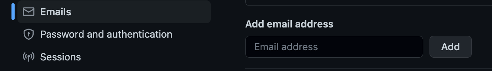
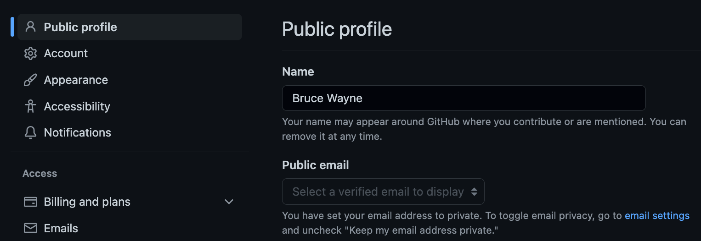

== Preparación Inicial -- "Hello, World!" en C

=== Objetivos
- Configurar el entorno de desarrollo para la cursada.
- Tener un primer contacto con las herramientas necesarias para abordar la resolución de los trabajos propuestos en el curso.
- Demostrar capacidad para editar, compilar, y ejecutar programas C mediante el desarrollo de un programa simple.
- Crear repositorio personal `git`.
- Armar de equipo de trabajo.

=== Temas
* Sistema de control de versiones.
* Lenguaje de programación C.
* Proceso de compilación.
* Pruebas.

=== Problema
Adquirir y preparar los recursos necesarias para resolver los trabajos del curso.

=== Restricciones
- Usar la versión *C23* del lenguaje C.

=== Tareas

. *Cuenta en _GitHub_*
.. Si no tiene, cree una cuenta _GitHub_.
.. Si no lo hizo, asocie a su cuenta _GitHub_ el email @frba y verifíquelo. 
Es posible asociar más de una cuenta email a una cuenta _GitHub_.
+

.. Si no lo hizo, indique que su cuenta email @frba es **pública**.
Esto permite a la cátedra encontrar a los estudiantes.
Si por temas de privacidad prefiere no tener como pública esa dirección, puede cambiarla al final del proceso.
+

. *Repositorio para público para la materia*
.. Cree un repositorio público llamado
  `SSL`.
.. En la raíz de ese repositorio, escriba el archivo `readme.md` que actúa como _front page del repositorio_ personal.  
.. Cree la carpeta
  `00-CHelloWorld`.
.. En esa carpeta, escriba un segundo archivo `readme.md` que actúa como _front page de la resolución_.  

. *Compilador*
.. Seleccione, instale, configure, y pruebe un compilador
*C23*, que es la versión publicada oficialmente en 2024; también se lo conoce como _C2x_. +
Los más osados pueden buscar un compilador que soporte *C2Y*.
La prueba del compilador consiste en:
... Escribir un programa
  `hello.c`
  que envíe a
  `stdout`
  la línea `Hello, World!` o similar.
  Opcionalmente, el mensaje puede incluir la versión del lenguaje.
... Compilar el programa, prefentemente desde la líne de comandos.
... Ejecutar el programa y verificar que la salida es la esperada.
... Ejecutar el programa con la salida <<CharacterInputOutputRedirection,_redireccionada_>> a un archivo `output.txt`; verificar su contenido.
... Como crédito extra, compilar con `make`.
... Como otro crédito extra, ejecutar con `make`.

. *Resultados* +
Registre los resultados anteriores en `readme.md` de la siguiente manera:
* el compilador seleccionado,
* la versión de ese compilador, 
* y la versión de *C* que el compilador compila.
+
[IMPORTANT]
====
Es importante separar dos conceptos: la *versión del compilador* de la *versión del lenguaje de programación*.
Una versión del compilador compila una o más versiones del lenguaje de programación.

Una forma de conocer la versión del compilador es solicitándolo por línea de comando. 
Por ejemplo: `gcc --version` ó `clang --version`.

Para conocer las versiones del lenguaje de programación que esa versión del compilador compila, se puede consultar la documentación de esa versión del compilador ó experimentar con la opción `-std`. 
Otra forma es utilizando el nombre predefinido `__STDC_VERSION__`.
====

. **Publicación** +
Publique el trabajo en el repositorio personal
  `SSL`
  la carpeta
  `00-CHelloWorld`
  con `readme.md`,
  `hello.c`,
  y `output.txt`.
  
. *Armado de Equipo*
+
Aunque el trabajo es individual, fomentamos la colaboración entre compañeros para su resolución. 
Consideramos que es una buena oportunidad para armar equipo para los trabajos siguientes que en su mayoría son grupales.
El docente del curso indica la cantidad de integrantes mínima y máxima por equipo.

.. Informe el número de equipo en
https://docs.google.com/spreadsheets/d/19MZodiTIjD2WuImE8Y0WijNxIRdfL6vF_DvCn3uYlWg[esta lista].
+
Con el número de equipo y cuenta @frba, la Cátedra le envía la invitación al repositorio privado del equipo, por eso es importante que su cuenta _GitHub_ tenga asociado como email público su email @frba, tal como indica el primer paso.
.. Luego de aceptar la invitación al repositorio privado del equipo, si lo desea, puede cambiar el email público en _GitHub_.

=== Productos
[{tree-block-type}]
--
Usuario                 // Usuario GitHub
`-- SSL                 // Repositorio público para la materia
    |-- readme.md       // Archivo front page del usuario
    `-- 00-CHelloWorld  // Carpeta el trabajo
        |-- readme.md   // Archivo front page del trabajo
        |-- hello.c     // Archivo fuente del programa
        `-- output.txt  // Archivo con la salida del programa
--

=== Referencia
* <<CompiladoresInstalacion>>
* <<KR1988>> § 1.1 Comenzado
* <<CharacterInputOutputRedirection>>
* <<Git101>>
* <<GNUMake>>
* <<SOLA_Make_2022>>
